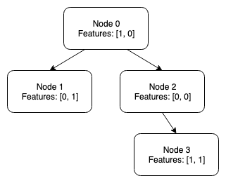

# pytorch-tree-lstm

This repo contains a PyTorch implementation of the child-sum Tree-LSTM model
([Tai et al. 2015](https://arxiv.org/abs/1503.00075)) implemented with
vectorized tree evaluation and batching.  This module has been tested with
Python 3.6.6, PyTorch 0.4.0, and PyTorch 1.0.1.

## High-level Approach

Efficient batching of tree data is complicated by the need to have evaluated all
of a node's children before we can evaluate the node itself.  To minimize the
performance impact of this issue, we break the node evaluation process into
steps such that at each step we evaluate all nodes for which all child
nodes have been previously evaluated.  This allows us to evaluate multiple nodes
with each torch operation, increasing computation speeds by an order of magnitude
over recursive approaches.

As an example, consider the following tree:



On the first step of the tree calculation, we can evaluate nodes 1 & 3 in parallel
as neither has any child nodes.  At the second step we are able to evaluate node
2, as its child node 3 was evaluated previously.  Lastly we evaluate node 0, which
depends on nodes 1 and 2.  Doing this we can reduce a four-node computation to three
steps.  Bigger trees with more leaf nodes will experience larger performance gains.

To facilitate this approach we encode the Tree structure and features into four
Tensors.  For a tree with N nodes, E edges, and F features, the required Tensors
are:

* `features` - A size N x F tensor containing the features for each node.
* `adjacency_list` - A size E x 2 tensor containing the node indexes of the
parent node and child node for every connection in the tree.
* `node_order` - A size N tensor containing the calculation step at which
a node can be evaluated.  Note that the order that node data is stored in `features`
and `node_order` must be identical.
* `edge_order` - A size E tensor containing the calculation step at which
each entry in the `adjacency_list` is needed in order to retrieve the child nodes
for a current node.  Note that the order that parent-child data is stored in
`adjacency_list` and `edge_order` must be identical.

`node_order` and `edge_order` hold redundant information
derivable from the `adjacency_list` and `features`; however, precomputing
these tensors gives a significant performance improvement due to the current
lack of an efficient set intersection function in PyTorch 1.0.  The order
tensors can be generated using the `treelstm.calculate_evaluation_orders`
function.  `calculate_evaluation_orders` accepts the `adjacency_list` tensor
and the length of the features tensor and returns the two order tensors:

```python
import treelstm
node_order, edge_order = treelstm.calculate_evaluation_orders(adjacency_list, len(features))
```

The tensor representation of the example tree above would be:

```python
features: tensor([[1., 0.],
                  [0., 1.],
                  [0., 0.],
                  [1., 1.]])

adjacency_list: tensor([[0, 1],
                        [0, 2],
                        [2, 3]])

node_order: tensor([2, 0, 1, 0])

edge_order: tensor([2, 2, 1])
```

## Installation

The `pytorch-tree-lstm` package can be installed via `pip`:

```bash
pip install pytorch-tree-lstm
```

Once installed, the library can be imported via:

```python
import treelstm
```

## Usage

The file `tree_list.py` contains the TreeLSTM module.  The module accepts the
`features`, `node_order`, `adjacency_list`, `edge_order`
tensors detailed above as input.

These tensors can be batched together by concatenation (`torch.cat()`) with the
exception of the `adjacency_list`.  The `adjacency_list` contains indexes into
the `features` tensor used to retrieve child features for performing sums over
node children, and when batched together these indexes must be adjusted for the
new position of the features in the batched tensors.

The `treelstm.batch_tree_input` function is provided to do this concatenation
and adjustment.  `treelstm.batch_tree_input` accepts a list of dictionaries
containing fields `features`, `node_order`, `adjacency_list`, and
`edge_order` and returns a dictionary containing those same fields
with the individual dictionaries in the list concatenated together and the
`adjacency_list` indexes adjusted, as well as a `tree_sizes` list storing the
size of each tree in the batch.  Given a PyTorch
[`Dataset`](https://pytorch.org/docs/stable/data.html#torch.utils.data.Dataset)
object that returns tree data as a dictionary of tensors with the above keys,
`treelstm.batch_tree_input` is suitable for use as a `collate_fn` argument to
the PyTorch
[`DataLoader`](https://pytorch.org/docs/stable/data.html#torch.utils.data.DataLoader)
object:

```python
import treelstm

train_data_generator = DataLoader(
    TreeDataset(),
    collate_fn=treelstm.batch_tree_input,
    batch_size=64
)
```

Unbatching the batched tensors can be done via

```python
torch.split(tensor, tree_sizes, dim=0)
```

Where `tree_sizes` is a list containing the number of nodes in each tree in the
batch.  This function is also provided by the `treelstm.unbatch_tree_tensor`
function for convenience.  As mentioned above, a `tree_sizes` list suitable for
use by this function is generated by `batch_tensors.batch_tree_tensor`.

## Example

Example code that generates tensors for the four node example tree above and
trains a toy classification problem against the Tree labels is available in
the `example_usage.py` script.
